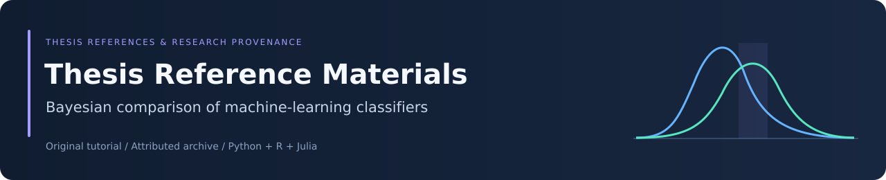

<div align="center">



# Thesis Reference Materials

### Bayesian methods for comparing machine-learning classifiers


[](LICENSE.md)

[Purpose](#purpose-and-provenance) · [Contents](#repository-contents) · [Using the materials](#using-the-materials) · [Citation](#citation-and-attribution)

</div>

## Purpose and provenance

This repository is a fork of [BayesianTestsML/tutorial](https://github.com/BayesianTestsML/tutorial), retained as reference material used during Abdullah Al Foysal's thesis work on statistical comparison of machine-learning classifiers.

**The original research, implementations, notebooks, and supporting materials belong to their respective authors.** This fork is a reference archive; it is not presented as an original software project or as the complete code and results of Foysal's thesis.

The upstream repository accompanies:

**Alessio Benavoli, Giorgio Corani, Janez Demšar, and Marco Zaffalon.**  
*Time for a Change: a Tutorial for Comparing Multiple Classifiers Through Bayesian Analysis.*  
Journal of Machine Learning Research, 18, 2017.

[Read the paper](https://jmlr.org/papers/volume18/16-305/16-305.pdf) · [Original repository](https://github.com/BayesianTestsML/tutorial)

## Repository contents

| Directory | Materials |
|---|---|
| [Python](Python) | Bayesian comparison functions and explanatory notebooks |
| [R](R) | Bayesian sign, signed-rank, and correlated t-test implementations |
| [Julia](Julia) | Tutorial notebooks, recorded classifier scores, statistical routines, and plots |
| [hierarchical](hierarchical) | Hierarchical analysis scripts, Stan model sources, and supporting materials |
| [slides](slides) | Tutorial presentations, notebooks, and illustrations |

The materials cover Bayesian correlated t-tests, Regions of Practical Equivalence (ROPE), nonparametric comparisons, and hierarchical comparison across datasets. Consult the paper for the assumptions, interpretation, and methodological context.

The archived data and outputs support the original tutorial. Their presence here does not imply that they are the datasets or results of a separate thesis experiment.

## Using the materials

To obtain the archive:

```bash
git clone https://github.com/Foysal-A-Al/Thesis-materials.git
cd Thesis-materials
```

Start with the paper, then select the notebook or script for the language and method you want to study. Check its imports, working-directory assumptions, data paths, and dependencies before execution.

These are historical research materials. Some interfaces and language syntax may require the original environment or adaptation for current tools. This fork does not provide a newly verified cross-language reproduction environment, and saved notebook outputs should be treated as archived results.

The upstream README points to a newer Python library:

- [baycomp source](https://github.com/janezd/baycomp)
- [baycomp documentation](https://baycomp.readthedocs.io/en/latest/)
- [R triangle-plot implementation by Libo](https://github.com/liboliba/Triangle_plot_bayes_cmp)

These are separate projects; their current APIs need not match the archived examples.

## Citation and attribution

When using the tutorial's methods, code, or figures in academic work, credit the original authors and cite the paper above. When identifying the source of downloaded materials, record the repository URL and exact commit used.

```bibtex
@article{benavoli2017time,
  author  = {Benavoli, Alessio and Corani, Giorgio and Demsar, Janez and Zaffalon, Marco},
  title   = {Time for a Change: a Tutorial for Comparing Multiple Classifiers Through Bayesian Analysis},
  journal = {Journal of Machine Learning Research},
  volume  = {18},
  year    = {2017},
  url     = {https://jmlr.org/papers/volume18/16-305/16-305.pdf}
}
```

The original implementations and research assets are preserved. The professional README and banner describe this fork's purpose and provenance.

## License

See the included [GNU General Public License, version 3](LICENSE.md). Preserve original attribution and applicable notices when reusing or redistributing materials.

Fork maintained as a thesis reference archive by [Abdullah Al Foysal](https://github.com/Foysal-A-Al).
